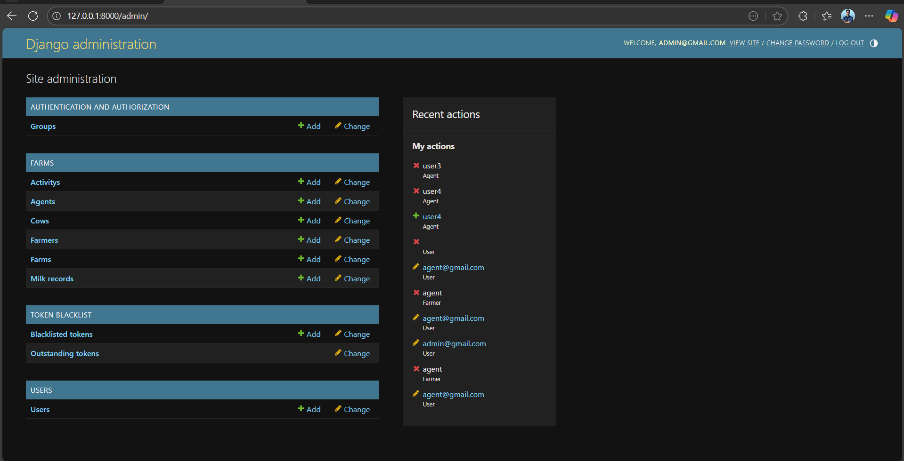

## FarmHub

A comprehensive farm management system with two microservices:

- Core Service (Django + DRF, port 8000):
  - Complete farm management system
  - User and agent management
  - Djoser authentication
  - Permission-based access control
  - Farm, Farmer, and Cow management
  - Milk production tracking
  - Activity logging

- Reporting Service (FastAPI, port 9000):
  - Read-only analytics and reporting
  - Farm performance metrics
  - Production summaries
  - Activity reports

### Project Screenshots

#### Dashboard View

*The main dashboard providing an overview of farm metrics and activities*

#### Farm Management Interface

*Interface for managing farms and related operations*


### Quick Start

```bash
docker compose up -d --build
```

Access Points:
- Core API: `http://localhost:8000`
  - Admin Dashboard: `http://localhost:8000/admin/`
  - API Documentation: `http://localhost:8000/api/`
- Reporting Service: `http://localhost:9000`
  - API Documentation: `http://localhost:9000/docs`
  - Health Check: `http://localhost:9000/health`

Database Configuration:
- Database Name: `farmhub_db`
- Username: `postgres`
- Password: `admin`

### Features

#### Farm Management
- Complete farm profile management with location and operational details
- Farmer registration and management
- Farm activity
- Production metrics monitoring
- Multi-farm support


*Detailed view of farm management interface showing farm details and associated farmers*

Who Can Access:
- Admin: Full access
- Agent: Can create and manage assigned farms
- Farmer: No access

#### Livestock Management
- Detailed cow profiles and health records
- Production history tracking
- Individual cow performance metrics
- Health tracking


*Cow management interface showing registration and tracking features*

#### Milk Production Tracking
- Daily milk production recording
- Individual cow production tracking
- Farm-wise production summaries


*Interface for recording and tracking milk production data*

Who Can Access:
- Admin: Full access
- Agent: Can view milk records for assigned farms
- Farmer: Can log daily milk production

#### Agent Management
- Agent profile management
- Farm assignment tracking


*Agent management interface showing profile and assignment features*

#### Farmer Management
- Add farmer under farm
- Farmer register cows


*Farmer management interface showing registration and cow assignment*

Who Can Access:
- Admin: Full access
- Agent: Can onboard farmers for assigned farms
- Farmer: Can view their own profile


#### Cow Management
- Cows is assigned under Farmer
- Can Record milk record of each cows
- Can gets summary of the cows in a given date range

Who Can Access:
- Admin: Full access
- Agent: Can manage cows for assigned farms
- Farmer: Can register and manage their own cows


*Interface showing cow details and milk production records*

### Role-Based Access Control

FarmHub implements a comprehensive role-based access control system with three primary roles:

#### SuperAdmin (Admin)
- **Full System Access**: Can perform all operations across the platform
- **Permissions**:
  - Create, view, update, and delete all entities (Farms, Farmers, Agents, Cows, Milk Records, Activities)
  - Access admin dashboard
  - Manage user accounts and roles
  - View all reports and analytics
  - Configure system settings


*Admin dashboard showing comprehensive management capabilities(See here that admin can add agents)*

#### Agent
- **Farm Management**: Oversees assigned farms and their operations
- **Permissions**:
  - Create farms and register farmers
  - Register and manage cows under their farms
  - Record and edit milk production data
  - Log health activities and events
  - View reports for farms they manage
  - Cannot modify other agents' farms or data
  - Cannot add or register admin


*Agent interface showing farm management capabilities(See an agent do't get options to create an agent)*

#### Farmer
- **Own Farm Operations**: Manages own livestock and production data
- **Permissions**:
  - Register and manage their own cows
  - Record daily milk production for their cows
  - Log health activities for their cows (vaccinations, births, health checks)
  - View summaries for their own production
  - Cannot access other farmers' data
  - Cannot create farms or register other farmers
  - Cannot add or access admin and agent data


*Farmer interface showing cow management and milk recording capabilities*

### Technologies Used

- **Core Service**:
  - Python 3.12+
  - Django 5.2
  - Django REST Framework
  - PostgreSQL Database
  - Djoser Authentication
  

*Django Admin interface customized for farm management*
  
- **Reporting Service**:
  - FastAPI
  - SQLAlchemy
  - Pydantic
  - Uvicorn
  

*FastAPI interactive documentation interface*
  
- **Development & Deployment**:
  - Docker & Docker Compose
  - Git version control
  - pytest for testing
  - Swagger/OpenAPI documentation

### Seed Data

```bash
docker compose exec core python manage.py seed_data
```

Creates:
- Admin user
- Sample agents
- Demo farms and farmers
- Test cows and milk records
- Activity logs


### API Documentation

#### Authentication Endpoints

| Method | Endpoint | Description | Roles |
|--------|----------|-------------|-------|
| POST | `/api/auth/users/` | Register new user | All |
| GET | `/api/auth/users/me/` | Get current user details | All |
| POST | `/api/auth/register/` | Custom registration endpoint | All |


#### Farm Management

| Method | Endpoint | Description | Roles |
|--------|----------|-------------|-------|
| GET | `/api/farms/` | List all farms | Admin, Agent |
| POST | `/api/farms/` | Create a new farm | Admin, Agent |
| GET | `/api/farms/{id}/` | Get farm details | Admin, Agent |
| PUT/PATCH | `/api/farms/{id}/` | Update farm | Admin, Agent |
| DELETE | `/api/farms/{id}/` | Delete farm | Admin |
| GET | `/api/farms/{farm_id}/farmers/` | List farmers in a farm | Admin, Agent |
| POST | `/api/farms/{farm_id}/farmers/` | Add farmer to farm | Admin, Agent |
| GET | `/api/farms/{farm_id}/activities/` | List farm activities | Admin, Agent, Farmer (own farm) |
| POST | `/api/farms/{farm_id}/activities/` | Add farm activity | Admin, Agent, Farmer (own farm) |

#### Farmer Management

| Method | Endpoint | Description | Roles |
|--------|----------|-------------|-------|
| GET | `/api/farmers/` | List all farmers | Admin, Agent |
| POST | `/api/farmers/` | Create a new farmer | Admin, Agent |
| GET | `/api/farmers/{id}/` | Get farmer details | Admin, Agent, Farmer (self) |
| PUT/PATCH | `/api/farmers/{id}/` | Update farmer | Admin, Agent, Farmer (self) |
| DELETE | `/api/farmers/{id}/` | Delete farmer | Admin |
| GET | `/api/farmers/{farmer_id}/cows/` | List farmer's cows | Admin, Agent, Farmer (own cows) |
| POST | `/api/farmers/{farmer_id}/cows/` | Add cow to farmer | Admin, Agent, Farmer (self) |

#### Cow Management

| Method | Endpoint | Description | Roles |
|--------|----------|-------------|-------|
| GET | `/api/cows/` | List all cows | Admin, Agent |
| POST | `/api/cows/` | Create a new cow | Admin, Agent, Farmer (own) |
| GET | `/api/cows/{id}/` | Get cow details | Admin, Agent, Farmer (own cow) |
| PUT/PATCH | `/api/cows/{id}/` | Update cow | Admin, Agent, Farmer (own cow) |
| DELETE | `/api/cows/{id}/` | Delete cow | Admin, Agent, Farmer (own cow) |
| GET | `/api/cows/{cow_id}/milk/` | Get cow's milk records | Admin, Agent, Farmer (own cow) |
| POST | `/api/cows/{cow_id}/milk/` | Add milk record for cow | Admin, Agent, Farmer (own cow) |
| GET | `/api/cows/{cow_id}/milk/summary/` | Get milk summary for cow | Admin, Agent, Farmer (own cow) |

#### Milk Records

| Method | Endpoint | Description | Roles |
|--------|----------|-------------|-------|
| GET | `/api/farms/{farm_id}/farmers/{farmer_id}/cows/{cow_id}/milk/` | Get milk records for specific cow | Admin, Agent, Farmer (own) |
| POST | `/api/farms/{farm_id}/farmers/{farmer_id}/cows/{cow_id}/milk/` | Add milk record for specific cow | Admin, Agent, Farmer (own) |
| GET | `/api/farms/{farm_id}/farmers/{farmer_id}/cows/{cow_id}/milk/summary/` | Get milk summary for specific cow | Admin, Agent, Farmer (own) |

#### Activities

| Method | Endpoint | Description | Roles |
|--------|----------|-------------|-------|
| GET | `/api/activities/` | List all activities | Admin, Agent |
| POST | `/api/activities/` | Create a new activity | Admin, Agent, Farmer |
| GET | `/api/activities/{id}/` | Get activity details | Admin, Agent, Farmer (own) |
| PUT/PATCH | `/api/activities/{id}/` | Update activity | Admin, Agent, Farmer (own) |
| DELETE | `/api/activities/{id}/` | Delete activity | Admin |

#### Agent Management

| Method | Endpoint | Description | Roles |
|--------|----------|-------------|-------|
| GET | `/api/agents/` | List all agents | Admin |
| POST | `/api/agents/` | Create a new agent | Admin |
| GET | `/api/agents/{id}/` | Get agent details | Admin |
| PUT/PATCH | `/api/agents/{id}/` | Update agent | Admin |
| DELETE | `/api/agents/{id}/` | Delete agent | Admin |

#### Reporting Service APIs

| Method | Endpoint | Description | Access |
|--------|----------|-------------|--------|
| GET | `/health` | Service health check | All |
| GET | `/farms/summary` | Summary of all farms | All |
| GET | `/farms/{farm_id}/summary` | Summary of specific farm | All |
| GET | `/farmers/summary` | Summary of all farmers | All |
| GET | `/farmers/{farmer_id}/summary` | Summary of specific farmer | All |
| GET | `/milk/summary` | Overall milk production summary | All |
| GET | `/milk/by-date` | Milk production by date range | All |
| GET | `/activities/recent` | Recent activities | All |


### Project Structure

```
FarmHub/
├── core/                    # Main Django service
│   ├── farmhub_core/        # Core configuration
│   │   ├── settings.py      # Django settings
│   │   ├── urls.py          # Main URL routing
│   │   └── wsgi.py          # WSGI configuration
│   ├── farms/               # Farm management app
│   │   ├── models.py        # Farm, Farmer, Cow models
│   │   ├── serializers.py   # API serializers
│   │   ├── views.py         # API views
│   │   └── urls.py          # Farm routes
│   ├── users/               # User management app
│   │   ├── serializers.py   # User serializers
│   │   ├── views.py         # User views
│   │   └── urls.py          # User routes
│   ├── Dockerfile           # Core service Dockerfile
│   └── requirements.txt     # Python dependencies
├── reporting/               # FastAPI reporting service
│   ├── app/                 # FastAPI application
│   │   ├── main.py          # FastAPI main app
│   │   └── routes/          # API routes
│   ├── Dockerfile           # Reporting service Dockerfile
│   └── requirements.txt     # Python dependencies
└── docker-compose.yml       # Docker Compose configuration
```

### Development Guidelines

#### Running Tests
```bash
# Core Service
cd core

# Reporting Service
cd reporting
```

#### Code Style
- Follow PEP 8 guidelines
- Use Django REST Framework best practices
- Maintain consistent documentation
- Write unit tests for new features

### Troubleshooting

#### Common Issues:

1. **Database Connection**
   - Verify PostgreSQL credentials
   - Check database service status
   - Ensure proper network connectivity

2. **Docker Issues**
   - Check container logs
   - Verify port availability
   - Ensure sufficient resources

#### Getting Help
- Check API documentation at service endpoints
- Review container logs
- Consult deployment guides

Creates admin/agent users, one farm, one farmer, two cows, milk records, and an activity.

### Local Development Setup

1. Create virtual environments for both services:
   ```bash
   # For Core Service
   python -m venv core/venv
   source core/venv/bin/activate  # or `core/venv/Scripts/activate` on Windows
   pip install -r core/requirements.txt

   # For Reporting Service
   python -m venv reporting/venv
   source reporting/venv/bin/activate  # or `reporting/venv/Scripts/activate` on Windows
   pip install -r reporting/requirements.txt
   ```

2. Configure environment variables:
   ```bash
   export POSTGRES_DB=farmhub_db
   export POSTGRES_USER=postgres
   export POSTGRES_PASSWORD=admin
   export POSTGRES_HOST=localhost
   export POSTGRES_PORT=5432
   ```

3. Run the services:
   ```bash
   # Core Service
   cd core
   python manage.py migrate
   python manage.py createsuperuser  # Create admin user
   python manage.py seed_data        # Optional: Load sample data
   python manage.py runserver 8000

   # Reporting Service
   cd reporting/app
   uvicorn main:app --reload --port 9000
   ```

